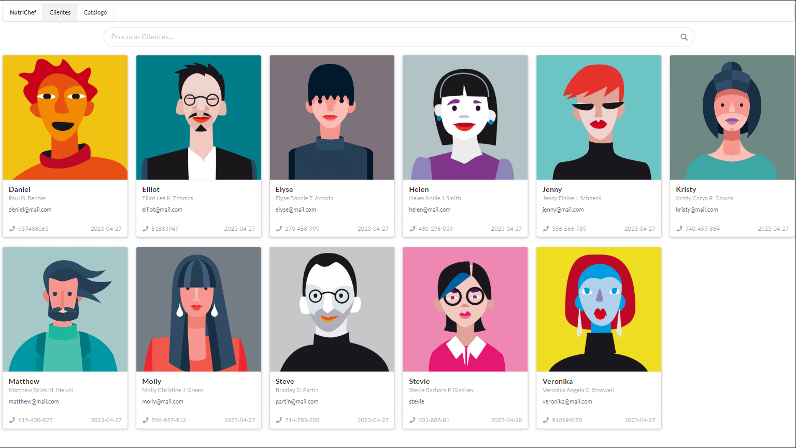

# nutri-chef
Sistema de geração de receitas para nutricionistas, usando um banco de dados de receitas que leva em consideração os alimentos que o cliente pode consumir para atingir seu objetivo de dieta.

**Vídeo de apresentação:**
[](https://youtu.be/8wnvkoL6o_c)

## Get Started

Para executar o projeto você deve ter os seguintes softwares instalado na máquina:

* Python 3.7.+ (ou superior)

### Instalando dependências:

```shell
python -m pip install -r requirements.txt
```

### Carregando dados iniciais

Dentro da pasta `/app` execute os seguintes comandos:

```shell
python manage.py makemigrations
python manage.py migrate
python manage.py loaddata catalog
python manage.py loaddata client
```

### Deploy local

```shell
python manage.py runserver
```

> Dentro da pasta app

## Problema

- Os nutricionistas têm dificuldades em criar receitas personalizadas para seus pacientes com base em seus objetivos de dieta.

## Solução

- Sistema web de geração de receitas para nutricionistas, usando um banco de dados de receitas que leva em consideração os alimentos que o cliente pode consumir para atingir seu objetivo de dieta.

## Proposta de Valor Único

- Geração rápida e fácil de receitas personalizadas para cada paciente, usando um catálogo de receitas que leva em consideração as restrições alimentares e os objetivos de dieta.

## Segmentos de Clientes

- Nutricionistas que trabalham com pacientes que têm objetivos específicos de dieta.
